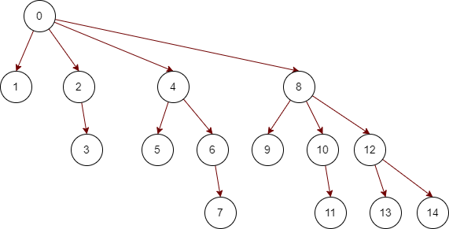

# recodebOOK_3

开第三本，主要是更改一下记录的格式

2022/3/11

### 2049.统计最高分的节点数目 middle 3/11 

:confused: :world_map:

又是邻接表建图

idx 值标记的是边 i标记的是节点原编号

e[idx] 保存该边指向的节点

he[i] 保存的是该点邻接的第一条边的idx值

ne[idx] 保存idx边保存邻接的下一条边

规则见题：简述为删除一个点后，

剩下的如果为一个连通块，则分数为他的节点数，

如果剩下的为多个，则为多个连通块相乘的积。

返回的是最多分数节点的个数

先建图，然后dfs得到f[] 保存每个节点作为根节点的子树的节点数目

对于大树的根节点来说 得分 a=Σ f[i] （i为0结点的子节点）

对于非根节点来说，删除该节点x后，a还应该乘上（n-f(x)）即根据树的定义，还有一个连通块的节点数等于n-f(x)并且相当于与x的子树通过x的入边相连接

### 590.N叉树的后序遍历 easy 3/12

后序遍历，直接dfs递归做法最快

### 平衡二叉树最多节点数计算

如果根节点高度为1（有的可以改为深度从0开始，反正1偏置）

S[1]=1,S[2]=2

S[i]=S[i-1]+S[i-2]+1

### 393.UTF-8编码验证

简单模拟

UTF-8是一个不定长的编码，最多由四个字节构成

字节1：0xxxxxxx

字节2：110xxxxx 10xxxxxx

字节3：1110xxxx 10xxxxxx 10xxxxxx

字节4：11110xxx 10xxxxxx 10xxxxxx 10xxxxxx

重点在于怎么写这个判断模拟的地方

由于输入的是数组，所以我们要根据第一个数字的前缀拍段一共多少字节有效

😅住了家人们，原来这个题不是判断某几个字节是不是一个UTF8，而是一串序列，相当于一段字符。

所以这个循环得判断多一点通俗一点

接上得到cnt如果是有效的话，检测该cnt个后续字节是否满足标准，然后再跳转到下一个UTF8开头进行下一个循环

期间可以针对cnt，data[]内字节的长度等进行长度判断提前退出（也是防止越界）

### 599.两个列表的最小索引总和 easy 3/14

哈希表模拟题

先用哈希表记录第一个序列的值和索引值

再遍历第二个，再通过哈希表的查询以及索引值的大小，来添加，清空重置，或者跳过答案值

### 2044.统计按位或能得到最大值的子集数目 middle 3/15

首先说到子集统计，如果集合本身个数不多的情况下，可以选择利用int或者long的比特位来统计i位是否被本次子集统计使用

当然有的情况也可以针对当前子集里面部分数的多少来，也可能数频统计获得一定的加速

1994.好子集的数目 之前做过，困难题，到时候可以一并做做。

其一优化，状压DP

在之前的遍历中，对于state递增的趋势而言，显然有一部分被重复计算了，所以我们加入DP数组

f[state] = f[state-lowbit]|num[idx]

转移方程简单来说就是把state中最低的1剃掉（state-lowbit）然后取并num[idx]

~~注意这里求得是最低，不是最高
并不是类似于1110= 1000 + 0110这种扩展，鹅好像也不是不可以，可以试试~~

好吧其实也可以 状态s我们是递增遍历
假如状态1110 可以由 1000+0110 得到
也可以由 1100 + 0010 得到，重要的是dp的思想

求得最低1比特位 lowbit = (s &-s) 学到了

这个lowbit以及对应的idx值我们用个hashmap来存储

### 432.全O(1)的数据结构

设计一个用于储存字符串计数的数据结构，能够返回计数最小和最大的字符串（由题目可知复杂度要求）

虽然插入的长度不超过10，但是哈希表仅仅能够做到O(1)的计数，无法做到O(1)的查询

采取LFUCache的思路，自定义节点并手写双链表
    
前置 🧀 146. LRU 缓存机制

### 146.LRU缓存 middle 3/17

实现一个最近最少使用缓存约束的数据结构，删除最后使用

用set储存是否已经被储存

并建立双向链表储存

如果已经储存，则把节点移动到表头refresh

如果未储存，容量未满，则加入到表头

如果储存已满，则删掉表尾节点，再加入表头

(以上操作均对应代码中的函数)

减少左右节点的判空操作，我们可以头尾建立两个哨兵节点（key=-1,value=-1）作为

### 720.词典中最长的单词 middle 3/17

这个最长需要单词由给定字符串序列中其他词汇挨个构成

比如"word" 还必须要有"w""wo""wor"

数据量小，本身可以set来做，但是这里我复习一下trie树

str.compareTo(str2) 比较两个字符串asc码大小，可以用于返回最小序列，如果返回>0 则为str更大

### 2043.简易银行系统 middle 3/18

简单模拟操作即可，不用搞花的

麻，用例来花的，超出用户的，用户标号比下标加一😅

### 606.根据二叉树创建字符串 easy 3/19

根据前序遍历，和括号配合一下，构建字符串

这里的最外层（根节点）没有括号，最后返回的时候解决一下就好。

如果左子树为空但是右子树不为空的话要()占位

### 2039.网络空闲的时刻 middle 3/20

对于每个服务器而言（除开根服务器），可以通过dij获得一个最短路径长度（每条边权重为1），即第一次收到返回消息的时间为di=2*dist[i]

由于服务器还存在重新发送信息的操作，如果在收到之前，还能够发送消息（di<=patence[i]）

如果会重新发送，则最后停止时间为（di-1）/t *t + di

然后选出所有结点的最大值

无论是建图还是dist，直接就static一个数组，每次重新fill一下速度是最快的

dij对于每个边权重相同的话，可以直接利用队列来处理（而不是优先堆）因为越后面加入队列，则边越多，路径也就越长。

蛤蛤其实这不就是BFS嘛

注意最后是问最早的空闲时间，所以我们需要把最后算出来的最大时间（最后还在活动的时间，最后一个接收到返回信息的时间）**+1**作为返回

### 653. 两数之和 IV - 输入 BST easy 3/21

可以简单的递归左右子树，用set储存已经存在的值，并且判断当前值

但是这个方法没有利用BST树的性质

后面会补上一个双指针利用BST树的性质    

### 2038. 如果相邻两个颜色均相同则删除当前颜色 middle 3/22

甲先手，乙后手，甲必须消除AAA中间的A，乙必须消出BBB中间的B

### 661.图片平滑器 easy 3/24

对于本题的数据范围

简单朴素的做法是我们可以想到利用八个方向的遍历模拟，直接得到平均值

但是这里我们利用二位前缀和来进行一个优化（模板题304）

**前缀和一般来说构建数组从1开始有意义，因为这样可以避免处理第一个元素**

简单来说一维前缀和a[i]指的是下标i及以前的，然后a[i][j]相当于就是对于二维数组左上角的部分的和（到时候取的时候的减去相对复杂一丢丢）

### 172.阶乘后的零 middle 3/25

对于一个阶乘数来说，0的个数取绝于他10的因子数，并且由质因数2*5的来，
因此这个题显然为质因数统计运用题目

如何找到一个数的质因数的个数呢

对于p而言，至少含有1个p的倍数 c1=n/p

至少含有k个p的倍数 cn = n / p^k

总个数c =  c1+c2+...cn

c互相之间有个包容子集的关系，之和就为总数

显然5要小于2的个数，所以我们只用统计5的质因数即可

这里可以通过递归的方式来进行统计

### 682.棒球比赛 easy 3/26

相当于给定一个字符串，然后解析这个字符串表示的得分含义（有的是字符，需要和前面的得分数字等进行操作）

虽然一开始我想的是，最多会操作前面两个得分，但是涉及到前一个操作无效的情况，还不如直接开一个纯粹记录得分的int数组，能够简单有效的记录得分，(前一次得分无效直接利用数组的尾指针前移即可)最后在统一相加即可

### 2028.找出缺失的观测数据 middle 3/27

一堆数据，丢失一部分，但是给你平均值，你能否给出其中一组满足条件的丢失数组

这个可以模拟，比如丢失n,剩余m，（m+n）*mean - sum(n个已知) 的范围 [n,6*n]

如果在范围外面，则可以直接返回空数组

如果在范围内，我们可以首先利用平均的想法，分配每个筛子的个数，向下取整，如果不能正好平分，则我们可以看向下取整后还差多少，然后在部分骰子+1即可。

### 693.交替位二进制数 easy 3/28

判断n这个数二进制是否是01交替的

除了简单模拟，还有一个很巧妙的利用二进制计算的方法

简单模拟也提一句，一开始用-1（111111...111）来进行异或比较效果非常好，后续在用0和1与n的剩下位数依次异或

原因是第一次可以异或结果为（11111...0）或者（11111...1），不会出现非零，因为第一次无论如何都不会失败，如果用1的话则需要与后面的循环判断分离。

🐎如果一个数为交替数，那么他移位并与原数异或后会得到：

x=0000...1111

x+1=0001...0000

x&(x+1)==0

可以利用这个来判断

### 2024.考试的最大困扰度 middle 3/29

对一个字符串{T,F}操作不超过k次，最大化连续相同的次数

比方说我们可以这样想（先换成01）

00001000100 k=2,如果换成连续的0的话，其实我们需要找连续包含两个1的最长连续字段

同理我们找最长连续F就是找包含k个T的最长连续字段
。最长T同理

利用滑动窗口来找

### 728.自除数 easy 3/31

简单模拟即可，或者提前打表（哈希或者数组），然后输出

### 744.寻找比目标字母大的最小字母 easy 4/3

简单模拟题，但是由于给定有序，则可以使用二分的做法

如果不存在也要返回第一个

### 307.区域和检索 - 数组可修改 middle 4/4

转叶总的总结：针对该题延展的一类题

1.数组不变，求区间和：「前缀和」、「树状数组」、「线段树」

2.多次修改某个数，求区间和：「树状数组」、「线段树」

3.多次整体修改某个区间，求区间和：「线段树」、「树状数组」（看修改区间的数据范围）

4.多次将某个区间变成同一个数，求区间和：「线段树」、「树状数组」（看修改区间的数据范围）

虽然线段树范围最多，但是也最难写，所以我们一般除开第四种情况不考虑

1.简单求区间和，前缀和

2.多次将某个区间变成同一个数，线段树

3.其他情况，树状数组

题目要求是对一个数据结构完成查询某个位置，以及区域和

这里今天就先学经典的树状数组（代码后面还有树状数组的模板）将复杂度降为ln

主要核心是从二进制分解进行出发理解

把区间储存的值**分层**是最核心的观点，

**我的总结就是一种分层化的前缀和（带左右边界）**

在tree[]中 idx为1101中存储的是什么？sum(1,13)

1101 = 1*2^3 + 1*2^2 + 0*2^1 + 1*2^0 = 1000+0100+0001

这样就分成了三层（注意下面我的分层也就是tree里面的下标）

**有几个1就是第几层**

1000层储存（1，8）sum

1000+0100层储存（9，12）sum

1000+0100+0001层储存（13，13）sum

新数组的下标从1开始，而原数组的下标从0开始

一共有两个核心基础操作：

一个是add 用于更新tree

一个是query 用于利用tree来查询原数组给定左右边界的sum

🐎为什么树状数组快呢？

如果是前缀和，那么更新的话idx后面所有都需要更新，On的复杂度

但是如果按照我们的分层思想，那么只需要更新同一层，同一个根节点后面的即可

例如第一个数更新了，要更新0001，0010，0100，1000

0010=0001+0001，0100=0010+0010，1000=0100+0100

这个图很好的显示了他的树形关系

**范围和由指向边的形式表达**

**前缀和就是从节点到0根结点的一个追溯**

**更新操作只需要更新同一个根节点，同一层，后面的节点**

https://blog.csdn.net/Yaokai_AssultMaster/article/details/79492190 讲的很好,图也是仿作的，🙇‍

